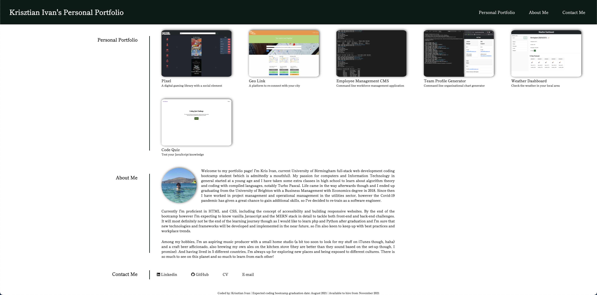

# Personal Portfolio

## Description

In this project I had to create a personal portfolio page to showcase deployed web applications for potential employers. The page had to be responsive, using flex containers and media queries with 3 main sections:

- Portfolio projects
- About me
- Contact me

## What I've done

- [x] Created HTML layout with semantic elements and flex containers
- [x] Added CSS flex styles
- [x] Added media queries to make the website responsive
- [x] Added nav elements to jump to the different sections
- [x] Added images to the portfolio items
- [x] Uploaded the project to a unique github repository with unique commit messages
- [x] Deployed the website to GitHub Pages

## Link to deployed website

https://ivnkris.github.io/personal-portfolio/

## Link to GitHub repository

https://github.com/ivnkris/personal-portfolio

## Screenshots

